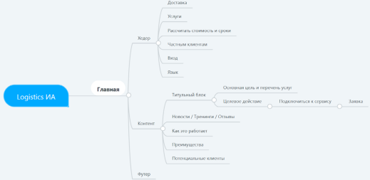

# -1 ОСНОВЫ WEB ДИЗАЙНА
## ИНФОРМАЦИОННАЯ АРХИТЕКТУРА. ВИДЫ ИМОДЕЛИ
Как книга начинается с содержания, так веб-сайт
начинается с информационной архитектуры. Информационная архитектура – каркас веб-проекта.
Информационная архитектура (ИА) – это инструмент проектирования пользовательского опыта
для решения поставленных перед проектом задач.
Однако, информационная архитектура не подразумевает работу со структурой продукта.
Информационная архитектура включает
в себя систематизацию контента и потоков веб-сайта
или приложения. Такая систематизация подразумевает анализ значимости представленного контента
на сайте для пользователей. Большая часть успеха
ИА зависит от совпадения ожиданий конечного пользователя и UX-специалиста.
ИА определяется несколькими принципами:
1. Как контент будет организован?
2. Как контент будет идентифицирован (маркирован)?
3. Какую информацию ожидают найти пользователи, в каких объемах?
4. Какие ожидания пользователя касательно процесса навигации по сайту?
5. В каком виде пользователи ожидают получить искомую информацию? Как они будут взаимодействовать с ней?
Информационная архитектура – первая наглядная иллюстрация, которая возникает не на уровне
слайдов, текстов, разговора. Метод построения информационной архитектуры используется для того,
чтобы наиболее структурировано и понятно описать
общую концепцию сайта.
Луис Розенфельд еще в 1999 году в книге «Информационная архитектура в Интернете» описал,
чем на самом деле занимается ИА. По его словам,
«Информационная архитектура занимается систематизацией информации и навигации по ней с целью
помочь пользователям быстрее и удобнее находить
и обрабатывать искомые данные». Как видим, эта
фраза до сих пор остается актуальной.
Для разработчика информационная архитектура – это, в первую очередь, инструмент для самоанализа, а также наглядная демонстрация концептуальных идей, которую можно показать заказчикам,
инвесторам, проектировщикам и т. д.
Проработанная архитектура – это отличное руководство для разработчиков. Чем детальнее разработана информационная архитектура, тем проще
развивать проект в дальнейшем.
Также ИА хороша тем, что в ней можно легко отследить наличие «тупиковых» ситуаций для пользователя в процессе взаимодействия. Такие ситуации
могут негативно сказаться на впечатлении от сайта
и конверсии.
Информационная архитектура может распространить свое влияние и на физические объекты.
Возьмем, к примеру, торговый молл. Вся его навигация, все направляющие элементы – это тоже часть информационной архитектуры
### ИНФОРМАЦИОННАЯ АРХИТЕКТУРА. ВИДЫ И МОДЕЛИ
Создать ИА можно даже с помощью бумаги и карандаша. Но намного удобнее будет использовать
программу для составления интеллект-карт, например, MindMeister (рис. 1).
Процесс построение такой структуры можно
разбить на несколько шагов.
Первый шаг. Когда пользователь заходит на страницу, первое, что он видит – хедер (рис. 2).
После к структуре добавляются футер и непосредственно сам контент (рис. 3).

 
